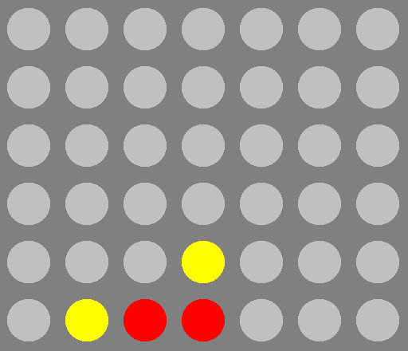

# C4 Engine
A connect 4 engine written in C++, using traditional AI methods -- with a Qt frontend.



## Intallation
Build the application with CMake.
```
git clone https://github.com/hunterwellis/C4-Solver.git
cd C4-Solver
mkdir build && cd build
cmake ..
make
./connect4 # run the bot
```
## Requirements
This application uses Qt GUI (on Debian/Ubuntu):
```
sudo apt update
sudo apt-get install build-essential libgl1-mesa-dev
sudo apt install qt6-base-dev qt6-tools-dev qt6-tools-dev-tools qtcreator
```

